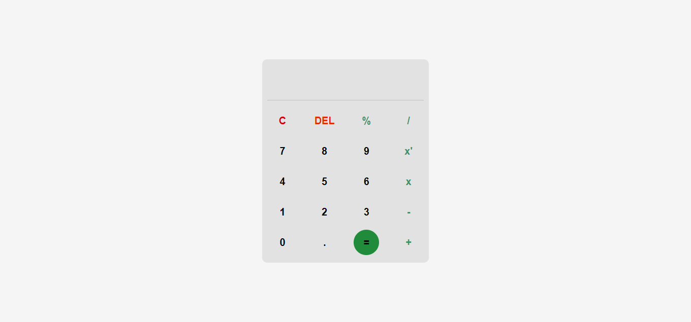

# Calculadora

## Conteúdo
- [Sobre](#sobre)
- [Link](#link)
- [Tecnologias](#tecnologias)
- [Autor](#autor)

## Sobre
Calculadora com funções simples. Para fazer um cálculo basta clicar no botão do número e na operação e clicar no símbolo de igual.

## Link
- Site - https://basic-calculadora.netlify.app

## Tecnologias
- HTML
- CSS
- Javascript

## Autor
- Site - https://sanches-spoladore.netlify.app